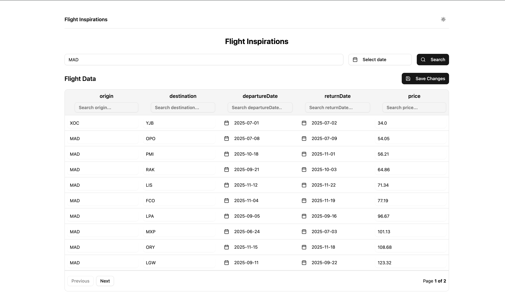

# ✈️ Flight Inspirations




> **Live Demo**: [https://flight-inspirations.vercel.app](https://flight-inspirations.vercel.app)  
> **GitHub Repo**: [https://github.com/maisjamil1/flight-inspirations](https://github.com/maisjamil1/flight-inspirations)

---

## 🚀 Tech Stack

- **React 19**
- **Vite**
- **Tailwind CSS**
- **shadcn/ui** for accessible UI components
- **@tanstack/react-table** for dynamic tables
- **axios** for HTTP requests
- **date-fns** for date manipulation
- **Radix UI** for headless UI primitives

---

## 🛠️ Getting Started

To install and run this project locally:


   ```bash
   git clone https://github.com/maisjamil1/flight-inspirations.git
   cd flight-inspirations
   npm install
   npm run dev
```
## 📂 Project Structure
This project follows a feature-based folder structure:
### 📁 Benefits of Feature-Based Organization
- Cohesion: Related files are grouped together.

- Isolation: Easier to manage and scale features independently.

- Team Collaboration: Teams can work on separate features without conflict.

- Scalability: New features integrate smoothly without disrupting existing ones.

- Testing: Easier to write and maintain focused unit tests.

## 🎨 Why Tailwind CSS and shadcn/ui?
- Tailwind CSS provides utility-first styling for rapid development and consistent design. It allows complete control over UI without writing custom CSS.

- shadcn/ui builds on top of Radix UI, offering ready-made, accessible components styled with Tailwind. It ensures best practices in accessibility and UI consistency with minimal setup.


## 🔮 Future Enhancements
✅ Use React Query to handle and cache API requests efficiently.

✅ Integrate Zustand as a lightweight global state management solution.

✅ More refactoring